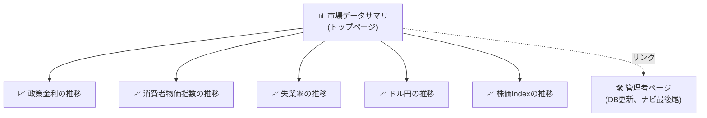

# マクロ経済ダッシュボード

> **🤖 このプロジェクトについて**: 本リポジトリは [Claude](https://claude.com/claude-code) との対話(vibecoding)でコードの大部分を生成しています。設計・実装・README含め、AIエージェントに指示を出しながら作成したものです。ご利用・改変は自由ですが、その前提でご覧ください。

日本とアメリカの主要マクロ指標を1画面で確認できるStreamlit製ツールです。「市場データサマリ」で最新値を一覧し、各指標をクリックすると日次の時系列推移画面に遷移できます。

## クイックスタート(ダウンロード後にやること)

本リポジトリには取得済みのローカルDB(`data/macro_dashboard.sqlite3`)を同梱しているため、**APIキーなしで、依存パッケージを入れてすぐに閲覧できます。**

### 1. 依存パッケージのインストール

```bash
python -m venv .venv
.venv\Scripts\activate      # Windows
pip install -r requirements.txt
```

### 2. 起動

```bash
streamlit run app.py
```

ブラウザで `http://localhost:8501` が自動的に開きます。同梱DBの最新値がそのまま表示されます。

### 3. データを最新化したい場合(任意)

1. https://fred.stlouisfed.org/docs/api/api_key.html で無料のAPIキーを取得(登録後すぐ発行されます)
2. `.env.example` を `.env` にコピーし、取得したキーを設定

```bash
copy .env.example .env   # Windows
```

```
FRED_API_KEY=取得したキー
```

3. アプリを再起動し、サイドバー一番下の **「🛠️ 管理者ページ」** を開いて「🔄 FREDからDBを更新」ボタンを押す

`.env` は `.gitignore` 対象なので、GitHubには絶対に上がりません。GitHubに上がるのは `.env.example`(値が空欄のテンプレート)だけです。詳しくは [APIキーの取り扱い](#apiキーの取り扱い) を参照してください。

## 見られる情報

**市場データサマリ(トップページ、最新値)**
- 政策金利(日本: 無担保コールレート翌日物 / アメリカ: FF実効金利)
- 消費者物価指数 CPI(日本 / アメリカ)
- 失業率(日本 / アメリカ)
- ドル円(USD/JPY)
- 株価Index(日本: 日経平均株価 / アメリカ: S&P500)

**推移ページ(市場データサマリの各項目からリンクで遷移)**
- 政策金利の推移(日本・アメリカ)
- 消費者物価指数の推移(日本・アメリカ)
- 失業率の推移(日本・アメリカ)
- ドル円の推移
- 株価Indexの推移(日経平均・S&P500)

各推移ページでは、グラフに加えて最新値・生データ(表)・DB更新状況も確認できます。

**管理者ページ(データ更新、ナビゲーション最後尾)**
- ボタン1つでFREDから全指標を取得し、ローカルDBを更新
- 系列ごとの最終更新日時・エラー状況を一覧表示
- 通常の閲覧動線と分けるため、サイドバーの一番下に配置しています

## サイト構成



市場データサマリの各カードから対応する推移ページへ遷移でき、いずれのページからも「← 市場データサマリに戻る」で戻れます。管理者ページだけは通常の閲覧動線から独立していて、サイドバーの一番下からいつでもアクセスできます。

## アーキテクチャ

ダッシュボード画面(市場データサマリ / 各推移ページ)は **ローカルDBを読むだけ** で、FREDには一切アクセスしません。FREDへのアクセスは管理者ページ(`views/admin.py`)の「DB更新」ボタンを押したときにのみ発生します。

```
[FRED API] --(管理者ページのボタン)--> [SQLite DB] --(常時)--> [ダッシュボード画面]
```

これにより、ダッシュボードを開くたびにAPIを叩くことがなくなり、FREDが一時的に落ちていてもDBにデータさえあれば閲覧できます。

ページの並び順・表示名は [app.py](app.py) の `st.navigation([...])` で一元管理しています(ファイル名の連番に頼らないので、順番の入れ替えは `app.py` を編集するだけです)。

## データソース

すべての指標を [FRED (Federal Reserve Economic Data)](https://fred.stlouisfed.org/) から取得しています。FREDはセントルイス連邦準備銀行が提供する無料の経済統計データベースで、日本の指標もOECD経由で収録されているため、1つのAPIで日米両方をカバーできます。

| 指標 | 国 | FRED系列ID |
|---|---|---|
| 政策金利 | 日本 | `IRSTCB01JPM156N` |
| 政策金利 | アメリカ | `FEDFUNDS` |
| CPI | 日本 | `JPNCPIALLMINMEI` |
| CPI | アメリカ | `CPIAUCSL` |
| 失業率 | 日本 | `LRHUTTTTJPM156S` |
| 失業率 | アメリカ | `UNRATE` |
| ドル円 | - | `DEXJPUS` |
| 株価Index | 日本(日経平均) | `NIKKEI225` |
| 株価Index | アメリカ(S&P500) | `SP500` |

指標を追加・変更したい場合は [src/config.py](src/config.py) の `SERIES` 辞書を編集するだけで、市場データサマリ・推移ページの両方に自動反映されます。

## 構成

```
app.py                       # エントリーポイント(streamlit run app.py)。ページの並び順・表示名を定義
views/
  home.py                     # 市場データサマリ(トップページ、最新値一覧、DBを読むだけ)
  policy_rate.py              # 政策金利の推移
  cpi.py                      # CPIの推移
  unemployment.py             # 失業率の推移
  fx.py                       # ドル円の推移
  stock_index.py              # 株価Indexの推移
  admin.py                    # 管理者ページ(DB更新ボタン、ナビゲーション最後尾)
src/
  config.py                   # 指標とFRED系列IDの対応表(拡張ポイント)
  data_fetcher.py             # FRED取得の実処理(管理者ページの更新時のみ呼ばれる)
  db.py                       # SQLite保存・読み出し・一括更新(refresh_all)
  charts.py                   # 推移ページの共通描画処理(DBを読む)
data/
  macro_dashboard.sqlite3     # ローカルDB本体(取得済みデータをリポジトリに同梱、管理者ページから再生成も可能)
```

## APIキーの取り扱い

- 実際のAPIキーは `.env` にのみ書く。`.env` は `.gitignore` に登録済みで、`git status` / `git add` の対象に出てこないことを確認済み
- リポジトリに含まれるのは `.env.example`(`FRED_API_KEY=` の値が空欄のテンプレート)だけ。GitHubをcloneした人は、データを更新したい場合のみ自分で取得したキーを自分の `.env` に設定する必要がある(閲覧するだけなら同梱DBがあるため不要)
- `data/`(SQLite DB本体)はあえて `.gitignore` の対象外にしている。中身はFREDから取得した公開の経済統計値と更新日時のみで、APIキーや個人情報は含まれない(確認済み)。ダウンロードした人がAPIキーを用意しなくてもすぐにダッシュボードを試せるようにするための判断
- プロジェクト全体をgrepして確認済み: APIキー・メールアドレス等の個人情報は `.env` 以外のファイルに含まれていない

## 補足

- DBには系列ごとに「最終更新日時」「最終エラー」も記録され、管理者ページ・各推移ページの「DB更新状況」欄で確認できます。
- FRED APIが一時的に利用できなくても、DBに既存データがあればダッシュボードは通常どおり閲覧できます(その場合、対象系列だけ更新失敗としてエラーが記録されます)。
- 日本の指標(政策金利・CPI・失業率)はOECD経由でFREDに収録されているため、日本銀行や総務省統計局の公表値と更新タイミング・改定有無が異なる場合があります。
